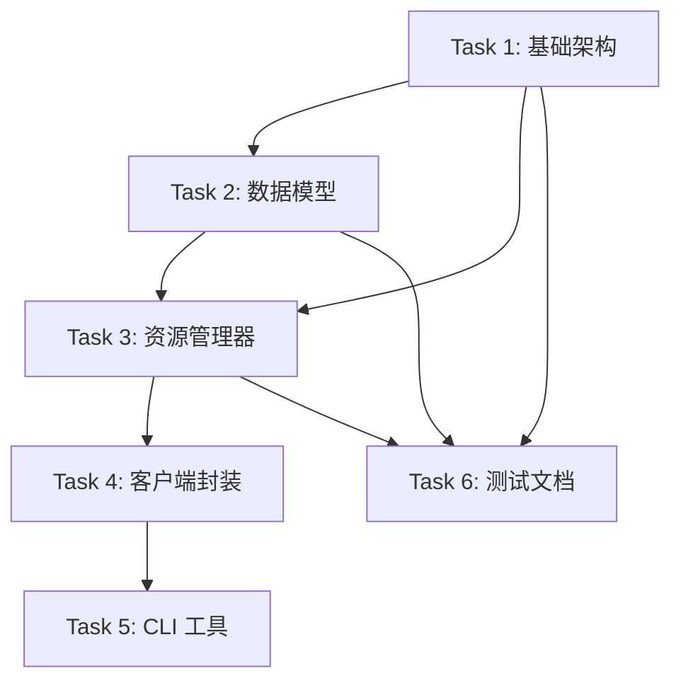

# PyNetBird 项目协调文档

## 🎭 总指挥职责

作为项目总指挥，我负责：
1. **任务分解和优先级排序**
2. **并行开发协调，避免代码冲突**
3. **接口规范制定，确保模块间兼容**
4. **质量标准监督**
5. **进度跟踪和风险管控**

## 📋 任务依赖关系图



## 🚦 并行开发策略

### 阶段 1: 基础建设 (并行度: 2)
- **Track A**: Task 1 (基础架构) - **优先级: 最高**
- **Track B**: Task 6-1 (测试框架搭建) - 可并行进行

### 阶段 2: 核心实现 (并行度: 2)
- **Track A**: Task 2 (数据模型) - 依赖 Task 1 完成
- **Track B**: Task 6-2 (文档编写) - 可并行进行

### 阶段 3: 业务逻辑 (并行度: 1)
- **Track A**: Task 3 (资源管理器) - 依赖 Task 1, 2 完成

### 阶段 4: 集成封装 (并行度: 2)
- **Track A**: Task 4 (客户端封装) - 依赖 Task 3 完成
- **Track B**: Task 5 (CLI 工具) - 可在 Task 4 完成后开始

### 阶段 5: 质量保证 (并行度: 2)
- **Track A**: Task 6-3 (集成测试) - 依赖所有功能完成
- **Track B**: Task 6-4 (性能测试和优化) - 可并行进行

## 🔧 接口规范

### 模块间接口约定

#### 1. 基础架构接口 (Task 1 → 其他 Task)
```python
# base.py 必须提供的接口
class BaseClient:
    def __init__(self, config: NetBirdConfig): ...
    def request(self, method: str, endpoint: str, **kwargs) -> dict: ...
    async def async_request(self, method: str, endpoint: str, **kwargs) -> dict: ...

# exceptions.py 必须提供的异常
NetBirdException, AuthenticationError, ResourceNotFoundError, 
ValidationError, RateLimitError, ServerError, NetworkError

# config.py 必须提供的配置类
@dataclass
class NetBirdConfig:
    api_key: str
    api_url: str = "https://api.netbird.io"
    timeout: int = 30
```

#### 2. 数据模型接口 (Task 2 → Task 3)
```python
# models/base.py
class BaseModel(pydantic.BaseModel):
    id: str
    created_at: Optional[datetime] = None
    updated_at: Optional[datetime] = None

# models/peer.py
class Peer(BaseModel):
    name: str
    ip: str
    connected: bool
    groups: List[GroupRef] = []

# models/group.py  
class Group(BaseModel):
    name: str
    peers_count: int
    peers: Optional[List[PeerRef]] = None
```

#### 3. 管理器接口 (Task 3 → Task 4)
```python
# managers/base.py
class BaseManager:
    def __init__(self, client: BaseClient): ...

# managers/peers.py
class PeersManager(BaseManager):
    def list(self) -> List[Peer]: ...
    def get(self, peer_id: str) -> Peer: ...
    def update(self, peer_id: str, **kwargs) -> Peer: ...
    def delete(self, peer_id: str) -> bool: ...
```

## 📦 文件冲突避免策略

### 目录分配
```
pynetbird/
├── base.py           # Task 1 负责
├── exceptions.py     # Task 1 负责
├── config.py        # Task 1 负责
├── utils.py         # Task 1 负责
├── models/          # Task 2 负责
│   ├── __init__.py
│   ├── base.py
│   ├── peer.py
│   ├── group.py
│   └── policy.py
├── managers/        # Task 3 负责
│   ├── base.py
│   ├── peers.py
│   ├── groups.py
│   └── policies.py
├── client.py        # Task 4 负责
├── async_client.py  # Task 4 负责
├── __init__.py     # Task 4 负责
└── cli/            # Task 5 负责
    ├── main.py
    ├── commands/
    └── formatters.py
```

### Git 协作策略
```bash
# 每个 Task 使用独立分支
git checkout -b task-1-base-architecture
git checkout -b task-2-data-models
git checkout -b task-3-managers
# ...

# 定期合并到 main 分支
git checkout main
git merge task-1-base-architecture
```

## 🎯 任务启动提示词模板

### 提示词标准格式
每个任务提示词包含：
1. **任务目标** - 明确要实现什么
2. **技术要求** - 使用的技术栈和约束
3. **文件清单** - 需要创建/修改的文件
4. **接口规范** - 必须实现的接口和约定
5. **测试要求** - 验证标准
6. **参考资料** - 现有代码和文档
7. **完成标准** - 交付标准和验收条件

### 当前可用的任务提示词
- ✅ **Task 1**: `TASK_1_PROMPT.md` - 基础架构实现
- 🔄 **Task 2**: 准备中 - 数据模型实现
- ⏳ **Task 3**: 等待 Task 1, 2 完成
- ⏳ **Task 4**: 等待 Task 3 完成
- ⏳ **Task 5**: 等待 Task 4 完成
- 🔄 **Task 6**: 部分可并行进行

## 📊 进度跟踪

### 当前状态
- [x] 项目规划和架构设计
- [x] Task 1 提示词创建
- [ ] Task 1 执行中
- [ ] Task 2 提示词准备
- [ ] ...

### 里程碑计划
- **里程碑 1**: 基础架构完成 (Task 1) - 预计 2 小时
- **里程碑 2**: 数据模型完成 (Task 2) - 预计 3 小时  
- **里程碑 3**: 核心功能完成 (Task 3) - 预计 4 小时
- **里程碑 4**: MVP 版本发布 (Task 1-4) - 预计 8 小时
- **里程碑 5**: 完整版本发布 (Task 1-6) - 预计 15 小时

## 🚨 风险管控

### 技术风险
1. **API 兼容性变化** - 解决方案: 版本适配器模式
2. **异步/同步接口统一** - 解决方案: 共享基础类
3. **测试数据模拟** - 解决方案: Mock API 响应

### 协作风险  
1. **接口不兼容** - 解决方案: 严格的接口规范
2. **代码冲突** - 解决方案: 目录分离 + 分支策略
3. **进度不同步** - 解决方案: 每日同步 + 里程碑检查

## 🎉 下一步行动

### 立即可执行的任务
1. **Task 1** - 使用 `TASK_1_PROMPT.md` 开始基础架构开发
2. **Task 6-1** - 搭建测试框架 (pytest + mock)
3. **Task 6-2** - 编写 README.md 和使用文档

### 等待生成的提示词
- Task 2: 数据模型 (等待 Task 1 接口确定)
- Task 3: 资源管理器 (等待 Task 1, 2 完成)

准备好开始了吗？建议先执行 Task 1，我会在完成后立即生成 Task 2 的提示词！